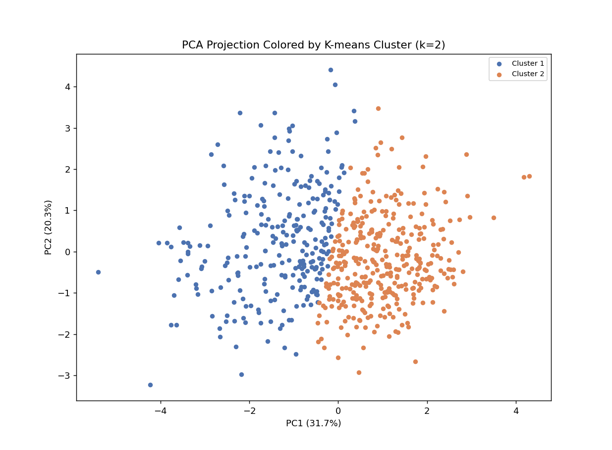
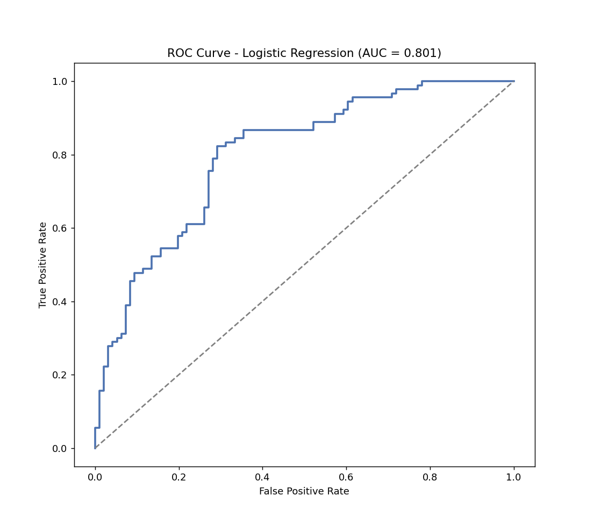
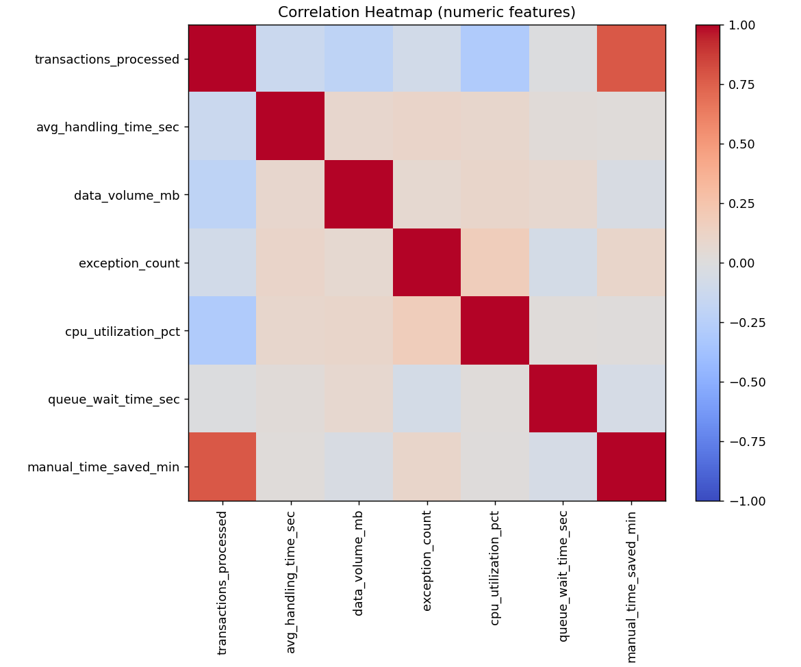

# Predicting SLA Outcomes in RPA Operations

An end-to-end machine learning project that analyzes robotic process automation (RPA) run telemetry, identifies operating patterns, and predicts whether a bot run will meet its service-level agreement (SLA).

The project reflects enterprise RPA environments such as Blue Prism and UiPath, where exception volume, queue delays, processing complexity, and resource usage affect operational reliability.

## Business problem

RPA support teams need an early way to identify runs that may require attention. This project builds a reproducible analytics pipeline that:

1. Generates realistic synthetic bot-run data with deliberate quality issues.
2. Cleans missing values, duplicate records, inconsistent categories, and extreme outliers.
3. Prepares numerical and categorical features for modeling.
4. Uses K-means clustering to identify operating profiles.
5. Compares logistic regression and a pruned decision tree for SLA prediction.
6. Evaluates the stronger model using accuracy, precision, recall, F1 score, and ROC-AUC.

## Python results

| Metric | Result |
|---|---:|
| Raw rows | 635 |
| Clean rows | 620 |
| Duplicate rows removed | 15 |
| Missing values after cleaning | 0 |
| Clusters selected | 2 |
| Best model | Logistic Regression |
| Logistic Regression accuracy | 72.04% |
| Decision Tree accuracy | 63.98% |
| Precision | 71.11% |
| Recall | 71.11% |
| F1 score | 71.11% |
| ROC-AUC | 0.801 |

The model shows useful discriminatory power for a portfolio-scale synthetic dataset. Precision and recall are balanced, while the ROC-AUC indicates meaningful separation between SLA outcomes across classification thresholds.

## Key findings

- Silhouette analysis selected two distinct operating profiles.
- One cluster contained slower, more exception-prone, higher-resource runs; the other represented higher-throughput, lower-friction activity.
- Logistic regression outperformed the pruned decision tree on the held-out test set.
- Transaction volume, handling time, exception count, queue wait time, and invoice-processing activity were retained during backward feature elimination.
- ROC-AUC was more informative than accuracy alone because it evaluates model discrimination across classification thresholds.

## Visual results

### RPA operating profiles



### SLA model performance



### Numeric feature relationships



## Repository structure

```text
.
|-- 01_generate_data.py
|-- 02_explore_clean_preprocess.py
|-- 03_cluster_classify_evaluate.py
|-- run_pipeline.py
|-- requirements.txt
|-- data/
|   |-- rpa_process_runs_raw.csv
|   |-- rpa_process_runs_clean.csv
|   |-- rpa_process_runs_preprocessed.csv
|   `-- rpa_process_runs_clustered.csv
|-- outputs/
|   `-- key_results.csv
|-- plots/
|   `-- generated analytical charts
`-- report/
    `-- Original_Course_Report_R.pdf
```

## How to run

```bash
python -m venv .venv
```

Activate the environment:

```bash
# Windows
.venv\Scripts\activate

# macOS/Linux
source .venv/bin/activate
```

Install dependencies and run the full pipeline:

```bash
pip install -r requirements.txt
python run_pipeline.py
```

Final metrics are written to `outputs/key_results.csv`. Generated charts are saved in `plots/`.

## Data note

The dataset is synthetic and was created because a public run-level RPA operations dataset with the required telemetry was not available. It intentionally contains missing values, inconsistent text, duplicates, and outliers so the cleaning workflow represents realistic operational data preparation.

## Report note

The included course report documents the original R-based analysis. The scripts in this repository are a Python implementation of the same workflow. The Python results shown in this README are generated directly from the checked-in code and may differ from the report because R and Python use different implementations for random generation, stepwise feature selection, and decision-tree pruning.

## Skills demonstrated

Python, pandas, NumPy, data cleaning, exploratory data analysis, feature engineering, K-means clustering, PCA, logistic regression, decision trees, cross-validation, confusion matrices, ROC-AUC, data visualization, RPA operations analytics, and business interpretation.
